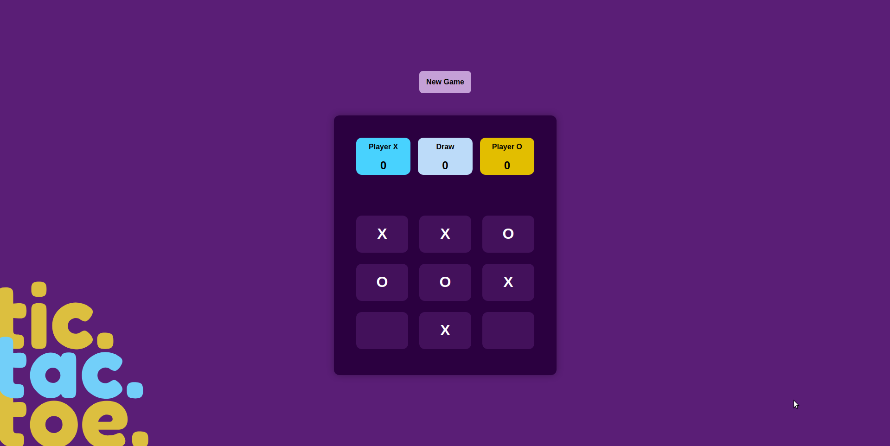

# 🎮 Tic Tac Toe Game

A classic **Tic Tac Toe** game built using **JavaScript**, **HTML**, and **CSS**, following the **Module Pattern** for clean and maintainable code structure. The game features two players (X and O), score tracking, and automatic reset after a win or draw.

## 📷 Screenshot

## 🚀 Demo

👉 [Play the Game](https://your-username.github.io/tic-tac-toe)

## 🛠️ Features

- Modular JavaScript architecture (GameBoard, DisplayController, GameController)
- Dynamic grid-based UI with clickable cells
- Real-time score tracking for Player X, Player O, and Draws
- Smooth reset after game ends
- Responsive layout with a themed SVG illustration

## 🧩 Technologies Used

- HTML5
- CSS3
- JavaScript (ES6+)

Made with ❤️ by Mohamed Mosilhy
